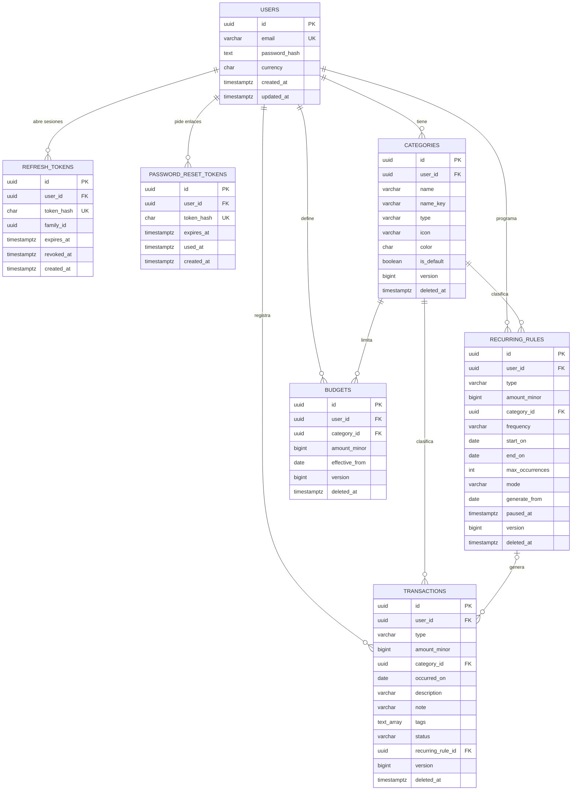

# Blueprint: App de Gastos Personales

## 1. Objetivo de este documento

Definir **qué se va a construir y cómo**: las historias de usuario con sus reglas y criterios de aceptación, el stack tecnológico, la arquitectura con su modelo de datos y las instrucciones que debe seguir una IA que programe el proyecto (el contenido completo de `AGENTS.md` y `CLAUDE.md`).

Es la **fuente de verdad del producto**. Si el código contradice este documento, el código está mal o el documento debe actualizarse primero. Las reglas de estilo de código, seguridad y pruebas están en el [README](README.md).

## 2. Objetivo del producto

Al completar las 15 historias, cualquier persona (joven profesional, trabajador independiente o estudiante) podrá **saber en todo momento cuánto dinero entra, cuánto sale y en qué se va**, con un hábito de registro que toma segundos y que funciona aunque no tenga internet.

En concreto, el usuario podrá:

- **Registrar** un gasto o ingreso en menos de 10 segundos, desde cualquier dispositivo y sin conexión.
- **Olvidarse** de los pagos fijos: los recurrentes se registran solos o se confirman con un toque.
- **Entender** su mes en una sola pantalla: ingresos, gastos, balance y en qué categorías gasta más.
- **Prevenir** el sobregasto con presupuestos por categoría que avisan al 80 % y al 100 %.
- **Tomar decisiones** con gráficos que muestran patrones de los últimos meses.

---

## 3. Conceptos base

| Concepto | Definición |
|---|---|
| **Movimiento** | Un gasto o un ingreso. Tiene tipo, monto, categoría, fecha, descripción, nota y etiquetas. |
| **Categoría** | Clasificación de un movimiento. Es de tipo *gasto* o *ingreso*. Las categorías de ingreso son las **fuentes** (Salario, Freelance…). |
| **Regla recurrente** | Plantilla que genera movimientos automáticamente con una frecuencia. |
| **Presupuesto** | Límite mensual de gasto para una categoría. |
| **Moneda** | Una por cuenta, elegida al registrarse. Los montos se guardan como enteros en centavos. |
| **Sincronización** | Envío de los cambios hechos sin conexión al servidor y recepción de los cambios de otros dispositivos. |

**Actores:**
- **Usuario:** dueño de sus finanzas; solo ve y modifica sus propios datos.
- **Sistema:** genera los movimientos recurrentes, calcula resúmenes y emite alertas de presupuesto.

---

## 4. Historias de usuario

### Mapa de historias

| Módulo | HU | Historia | Entrega |
|---|---|---|---|
| 1. Acceso | HU01 | Registro de usuario | R1 |
| | HU02 | Inicio y cierre de sesión | R1 |
| | HU03 | Recuperar contraseña | R1 |
| 2. Movimientos | HU04 | Registrar gasto | R1 |
| | HU05 | Registrar ingreso | R1 |
| | HU06 | Editar movimiento | R1 |
| | HU07 | Eliminar movimiento | R1 |
| 3. Organización | HU08 | Categorías personalizadas | R1 |
| | HU09 | Movimientos recurrentes | R2 |
| | HU10 | Notas y etiquetas | R2 |
| 4. Consulta | HU11 | Historial de movimientos | R1 |
| | HU12 | Búsqueda y filtros | R2 |
| | HU13 | Resumen mensual | R2 |
| 5. Control | HU14 | Presupuesto por categoría | R3 |
| | HU15 | Gráficos por categoría | R3 |

**Entregas:**
- **R1 (Núcleo):** la app ya sirve para el uso diario. Incluye la sincronización sin conexión desde el inicio.
- **R2 (Análisis):** automatiza los pagos fijos y permite encontrar y entender los movimientos.
- **R3 (Diferenciador):** control con presupuestos y gráficos.

---

### Módulo 1: Acceso y cuenta

#### HU01. Registro de usuario

> **Como** persona que quiere controlar su dinero,
> **quiero** crear una cuenta con mi correo y una contraseña,
> **para** tener un espacio personal y privado donde guardar mis finanzas y acceder a ellas desde cualquier dispositivo.

**Contexto:** es la puerta de entrada. Debe ser rápido (un solo formulario) y dejar la cuenta lista para usar, con categorías predeterminadas y moneda configurada.

**Reglas de negocio:**
1. El correo se guarda en minúsculas y sin espacios al inicio o al final. No puede estar registrado.
2. La contraseña tiene entre 8 y 128 caracteres, con al menos una letra y un número. Se pide confirmarla.
3. El usuario elige su moneda de una lista (código ISO 4217). Por defecto: COP. No se puede cambiar después en el MVP.
4. Al crear la cuenta se crean las **categorías predeterminadas**:
   - Gasto: Alimentación, Transporte, Vivienda, Servicios, Salud, Educación, Ocio, Compras, Otros gastos.
   - Ingreso: Salario, Trabajo independiente, Otros ingresos.
5. Al terminar el registro, el usuario queda con la sesión iniciada y entra a la pantalla de inicio.
6. **Requiere conexión a internet.**

**Criterios de aceptación:**

```gherkin
Escenario: Registro exitoso
  Dado que estoy en la pantalla de registro con conexión
  Cuando ingreso "Ana@Correo.com ", una contraseña válida, la confirmo y elijo COP
  Entonces se crea la cuenta con el correo "ana@correo.com"
  Y quedo con la sesión iniciada en la pantalla de inicio
  Y veo las 12 categorías predeterminadas

Escenario: Correo ya registrado
  Dado que ya existe una cuenta con "ana@correo.com"
  Cuando intento registrarme con ese correo
  Entonces veo "Ya existe una cuenta con este correo" y un enlace a "Iniciar sesión"
  Y no se crea ninguna cuenta

Escenario: Contraseña débil o que no coincide
  Cuando ingreso "abcdefgh" como contraseña
  Entonces veo "La contraseña debe tener al menos una letra y un número"
  Y el botón "Crear cuenta" permanece deshabilitado

Escenario: Sin conexión
  Dado que no tengo conexión
  Cuando abro la pantalla de registro
  Entonces veo "Necesitas internet para crear tu cuenta" y el formulario deshabilitado
```

**Casos límite:**
- Doble clic en "Crear cuenta": se envía una sola solicitud (botón deshabilitado mientras procesa).
- Error del servidor: mensaje genérico y el formulario conserva lo escrito (excepto las contraseñas).

**Fuera de alcance:** verificación del correo, registro con Google o Apple, cambio de moneda.

---

#### HU02. Inicio y cierre de sesión

> **Como** usuario registrado,
> **quiero** iniciar sesión en mis dispositivos y cerrarla cuando lo necesite,
> **para** que solo yo pueda ver mi información financiera, incluso si uso un computador compartido.

**Contexto:** la app funciona sin conexión, así que la sesión debe mantenerse abierta aunque no haya internet. Pero al cerrarla en un equipo compartido no debe quedar ningún dato.

**Reglas de negocio:**
1. El **primer inicio de sesión en cada dispositivo requiere conexión**. Después, la app abre sin internet con los datos locales.
2. La sesión dura hasta 30 días sin uso. Cada uso con conexión la renueva.
3. Ante credenciales incorrectas el mensaje es siempre el mismo: "Correo o contraseña incorrectos".
4. Tras **5 intentos fallidos en 15 minutos** (por correo e IP), el inicio de sesión se bloquea 15 minutos.
5. Al cerrar sesión:
   - Si hay cambios sin sincronizar, se advierte: "Tienes N cambios sin sincronizar. Si cierras sesión se perderán."
   - Si el usuario confirma (o no hay pendientes), se borran **todos** los datos locales y se invalida la sesión en el servidor.
6. Existe la opción "Cerrar sesión en todos los dispositivos" (en Ajustes).

**Criterios de aceptación:**

```gherkin
Escenario: Inicio de sesión exitoso en un dispositivo nuevo
  Dado que tengo una cuenta y estoy con conexión
  Cuando ingreso mi correo y contraseña correctos
  Entonces entro a la pantalla de inicio
  Y se descargan mis datos del servidor

Escenario: Abrir la app sin conexión con sesión previa
  Dado que ya inicié sesión antes en este navegador
  Y no tengo conexión
  Cuando abro la app
  Entonces entro directamente a la pantalla de inicio con mis datos locales
  Y veo el indicador "Sin conexión"

Escenario: Bloqueo por intentos fallidos
  Dado que fallé la contraseña 5 veces en 15 minutos
  Cuando intento de nuevo
  Entonces veo "Demasiados intentos. Intenta de nuevo en 15 minutos"

Escenario: Cerrar sesión con cambios pendientes
  Dado que tengo 3 movimientos sin sincronizar
  Cuando toco "Cerrar sesión"
  Entonces veo la advertencia con el número de cambios pendientes
  Y puedo elegir "Sincronizar primero" o "Cerrar de todas formas"

Escenario: Cerrar sesión borra los datos locales
  Cuando cierro sesión y confirmo
  Entonces vuelvo a la pantalla de inicio de sesión
  Y la base de datos local del navegador queda vacía
```

**Fuera de alcance:** autenticación en dos pasos, inicio de sesión con redes sociales, desbloqueo biométrico.

---

#### HU03. Recuperar contraseña

> **Como** usuario que olvidó su contraseña,
> **quiero** restablecerla a través de mi correo,
> **para** volver a acceder a mis datos sin perder nada.

**Reglas de negocio:**
1. El usuario escribe su correo y recibe un enlace de restablecimiento.
2. La respuesta en pantalla es **siempre la misma**, exista o no la cuenta: "Si el correo está registrado, recibirás un enlace en unos minutos."
3. El enlace **vence en 30 minutos** y sirve **una sola vez**. Pedir uno nuevo invalida los anteriores.
4. Máximo 3 solicitudes por correo cada hora.
5. La nueva contraseña cumple las reglas de la HU01.
6. Al cambiarla, **se cierran todas las sesiones** abiertas y el usuario debe iniciar sesión de nuevo.
7. Requiere conexión.

**Criterios de aceptación:**

```gherkin
Escenario: Solicitud de recuperación
  Cuando ingreso mi correo en "Olvidé mi contraseña"
  Entonces veo el mensaje genérico de confirmación
  Y recibo un correo con un enlace válido por 30 minutos

Escenario: Restablecer con enlace válido
  Dado que abro el enlace antes de 30 minutos
  Cuando ingreso y confirmo una contraseña válida
  Entonces veo "Contraseña actualizada" y voy a iniciar sesión
  Y mis otras sesiones quedan cerradas

Escenario: Enlace vencido o usado
  Dado que el enlace tiene más de 30 minutos o ya se usó
  Cuando lo abro
  Entonces veo "Este enlace ya no es válido" y la opción de pedir uno nuevo
```

---

### Módulo 2: Registro de movimientos

#### HU04. Registrar gasto

> **Como** usuario,
> **quiero** registrar un gasto con su monto, categoría, fecha y descripción en pocos segundos, incluso sin internet,
> **para** llevar un control real de en qué se va mi dinero sin que registrar sea una carga.

**Contexto:** es la acción más frecuente de la app. Si es lenta o complicada, el usuario abandona el hábito. Por eso debe estar siempre a un toque y guardar al instante.

**Reglas de negocio:**
1. **Campos:**

   | Campo | Obligatorio | Regla |
   |---|---|---|
   | Monto | Sí | Mayor que 0, hasta 13 dígitos. Acepta el formato local ("1.250.000" o "1250000,50"). |
   | Categoría | Sí | Solo categorías de tipo gasto. Se preselecciona la última usada. |
   | Fecha | Sí | Por defecto hoy. No puede ser futura. |
   | Descripción | No | Máximo 100 caracteres. |
   | Nota y etiquetas | No | Ver HU10. |

2. **Acceso rápido:** un botón "+" visible en todas las pantallas principales. Desde el inicio, el gasto se guarda en **3 toques o menos**: "+" → escribir monto → "Guardar".
3. El movimiento se guarda **en el dispositivo al instante**, con o sin conexión, y queda en cola para sincronizar.
4. Al guardar se actualizan de inmediato el balance, el historial, el resumen y los presupuestos. Si se cruza un umbral de presupuesto, se muestra la alerta de la HU14.
5. Se muestra la confirmación "Gasto guardado".

**Criterios de aceptación:**

```gherkin
Escenario: Registrar un gasto con los valores por defecto
  Dado que estoy en la pantalla de inicio
  Cuando toco "+", escribo 25.000 y toco "Guardar"
  Entonces se guarda un gasto de $25.000 con la última categoría usada y la fecha de hoy
  Y veo "Gasto guardado"
  Y el balance del mes disminuye en $25.000

Escenario: Registrar sin conexión
  Dado que no tengo conexión
  Cuando registro un gasto
  Entonces se guarda y aparece en el historial con el indicador "Pendiente de sincronizar"
  Y cuando vuelve la conexión se sincroniza sin que yo haga nada

Escenario: Monto inválido
  Cuando dejo el monto en 0 o vacío
  Entonces el botón "Guardar" está deshabilitado y veo "Ingresa un monto mayor que 0"

Escenario: Fecha futura
  Cuando elijo una fecha posterior a hoy
  Entonces veo "La fecha no puede ser futura" y no se puede guardar
```

**Casos límite:**
- Primer gasto de un usuario nuevo: no hay "última usada", se preselecciona "Otros gastos".
- Doble toque en "Guardar": se guarda un solo movimiento.

**Fuera de alcance:** adjuntar foto del recibo, dividir un gasto entre varias categorías, gastos en otra moneda.

---

#### HU05. Registrar ingreso

> **Como** usuario,
> **quiero** registrar un ingreso con su monto, fuente y fecha,
> **para** saber cuánto dinero entra cada mes y de dónde viene, especialmente si mis ingresos son variables.

**Reglas de negocio:**
1. Mismos campos y reglas de la HU04, pero la categoría (llamada **"Fuente"** en pantalla) debe ser de tipo ingreso.
2. En el formulario de "+" hay un selector **Gasto / Ingreso**. Gasto está seleccionado por defecto.
3. Los ingresos se muestran en verde y los gastos en rojo en toda la app.

**Criterios de aceptación:**

```gherkin
Escenario: Registrar un ingreso
  Cuando toco "+", selecciono "Ingreso", escribo 3.500.000, elijo "Salario" y guardo
  Entonces se guarda un ingreso de $3.500.000 con fuente Salario
  Y el total de ingresos del mes aumenta en ese valor

Escenario: Solo se muestran fuentes de ingreso
  Dado que seleccioné "Ingreso"
  Cuando abro el selector de fuente
  Entonces solo veo categorías de tipo ingreso
```

---

#### HU06. Editar movimiento

> **Como** usuario,
> **quiero** modificar cualquier dato de un movimiento ya registrado,
> **para** corregir errores de monto, fecha o categoría sin tener que borrarlo y crearlo de nuevo.

**Reglas de negocio:**
1. Desde el detalle de un movimiento se pueden editar: monto, categoría, fecha, descripción, nota y etiquetas. Aplican las mismas validaciones que al crearlo.
2. **El tipo (gasto o ingreso) no se puede cambiar.** Para eso se elimina y se crea otro. En pantalla se explica.
3. Editar un movimiento generado por una regla recurrente **solo cambia ese movimiento**, no la regla.
4. Funciona sin conexión.
5. Si el mismo movimiento se editó en dos dispositivos, **queda la última versión que llegó al servidor**.
6. Al guardar se recalculan el balance, el resumen y los presupuestos.

**Criterios de aceptación:**

```gherkin
Escenario: Corregir el monto
  Dado un gasto de $52.000 en "Alimentación"
  Cuando lo abro, cambio el monto a $25.000 y guardo
  Entonces el historial muestra $25.000
  Y el gasto del mes en "Alimentación" disminuye en $27.000

Escenario: Cambiar la categoría
  Cuando cambio la categoría de un gasto de "Ocio" a "Transporte"
  Entonces el movimiento aparece en "Transporte" en el resumen, los filtros y los presupuestos

Escenario: Cancelar la edición
  Cuando modifico campos y toco "Cancelar"
  Entonces el movimiento queda como estaba
```

---

#### HU07. Eliminar movimiento

> **Como** usuario,
> **quiero** eliminar un movimiento equivocado o duplicado, con la posibilidad de deshacerlo si me equivoco,
> **para** que mis cuentas reflejen solo lo que realmente pasó.

**Reglas de negocio:**
1. Se elimina desde el detalle del movimiento o deslizando en el historial.
2. Al eliminar aparece el aviso **"Movimiento eliminado · Deshacer"** durante 5 segundos. Si se toca "Deshacer", el movimiento vuelve exactamente como estaba.
3. La eliminación es lógica: el movimiento se marca como eliminado para poder sincronizar el borrado a los otros dispositivos. El usuario no vuelve a verlo.
4. Eliminar un movimiento generado por una regla recurrente **no vuelve a generarlo** ni afecta a la regla.
5. Funciona sin conexión.

**Criterios de aceptación:**

```gherkin
Escenario: Eliminar y deshacer
  Cuando elimino un gasto de $40.000
  Entonces desaparece del historial y el balance aumenta en $40.000
  Y cuando toco "Deshacer" antes de 5 segundos, el gasto vuelve y el balance se restablece

Escenario: Eliminación sincronizada
  Dado que elimino un movimiento en el computador
  Cuando abro la app en el celular con conexión
  Entonces el movimiento ya no aparece en el celular
```

**Fuera de alcance:** papelera de reciclaje, eliminar varios movimientos a la vez.

---

### Módulo 3: Organización

#### HU08. Categorías personalizadas

> **Como** usuario,
> **quiero** crear, renombrar y eliminar mis propias categorías de gasto e ingreso, con ícono y color,
> **para** clasificar mi dinero según mi forma de vivir y no según una lista genérica.

**Reglas de negocio:**
1. Cada categoría tiene nombre (1 a 30 caracteres), tipo (gasto o ingreso), ícono (de un conjunto predefinido) y color (de una paleta predefinida).
2. **El nombre no se repite dentro del mismo tipo**, sin distinguir mayúsculas ni tildes ("Café" y "cafe" son el mismo).
3. Las categorías predeterminadas se pueden renombrar y eliminar como cualquier otra.
4. **El tipo no se puede cambiar** si la categoría tiene movimientos.
5. **Eliminar una categoría con movimientos** obliga a elegir otra del mismo tipo. Los movimientos, reglas recurrentes y presupuestos se pasan a esa categoría. Si ambas tenían presupuesto, se conserva el de la categoría destino.
6. Siempre debe quedar **al menos una categoría de cada tipo**.
7. Funciona sin conexión.

**Criterios de aceptación:**

```gherkin
Escenario: Crear una categoría
  Cuando creo la categoría de gasto "Mascotas" con ícono 🐾 y color naranja
  Entonces aparece en el selector de categorías al registrar un gasto

Escenario: Nombre duplicado
  Dado que existe la categoría de gasto "Café"
  Cuando intento crear la categoría de gasto "cafe"
  Entonces veo "Ya tienes una categoría de gasto con ese nombre"

Escenario: Eliminar una categoría con movimientos
  Dado que "Ocio" tiene 12 movimientos
  Cuando la elimino
  Entonces debo elegir a qué categoría de gasto pasar esos 12 movimientos
  Y después de confirmar, los movimientos aparecen en la categoría elegida

Escenario: Última categoría de un tipo
  Dado que solo tengo una categoría de ingreso
  Cuando intento eliminarla
  Entonces veo "Debes tener al menos una categoría de ingreso"
```

---

#### HU09. Movimientos recurrentes

> **Como** usuario con pagos e ingresos que se repiten (arriendo, servicios, suscripciones, salario),
> **quiero** programarlos una sola vez para que se registren automáticamente o me pidan confirmación,
> **para** no tener que acordarme de registrarlos cada vez y que mis cuentas estén siempre completas.

**Contexto:** una de las principales razones por las que la gente abandona las apps de gastos es tener que registrar lo mismo cada mes. Esta historia lo resuelve y, además, permite anticipar los pagos que vienen.

**Reglas de negocio:**
1. **Creación:** desde cero ("Recurrentes" → "Nueva") o desde un movimiento existente ("Repetir este movimiento"). Campos:

   | Campo | Regla |
   |---|---|
   | Tipo, monto, categoría, descripción | Mismas reglas de la HU04 y la HU05 |
   | Frecuencia | Diaria, semanal, quincenal, mensual o anual |
   | Fecha de inicio | Obligatoria. Puede ser pasada o futura. |
   | Fin | Opcional: una fecha de fin o un número de repeticiones |
   | Modo | **Automático** o **Con confirmación** |

2. **Cómo se calculan las fechas:**
   - **Semanal:** el mismo día de la semana de la fecha de inicio.
   - **Quincenal:** los días **15 y último de cada mes** (como se paga el salario quincenal).
   - **Mensual:** el mismo día del mes de la fecha de inicio. Si ese día no existe en el mes (31 en abril, 30 en febrero), se usa el último día del mes.
   - **Anual:** misma fecha cada año. El 29 de febrero pasa al 28 en años no bisiestos.
3. **Modos:**
   - **Automático:** en su fecha, el movimiento se registra solo y cuenta en el balance.
   - **Con confirmación:** en su fecha aparece como **pendiente** en la sección "Por confirmar". No cuenta en el balance hasta que el usuario lo **confirme** (puede ajustar el monto antes) u **omita**. Sirve para montos variables, como la factura de la luz.
4. **Generación:** ocurre en el dispositivo al abrir la app y al volver a ella. Se generan **todas las fechas que quedaron atrás** desde la última vez, con un máximo de 366 por regla.
5. **Sin duplicados:** cada ocurrencia tiene un ID calculado a partir de la regla y la fecha. Si dos dispositivos la generan, al sincronizar queda una sola. Una ocurrencia eliminada u omitida **no se vuelve a generar**.
6. **Editar la regla** afecta solo las fechas **posteriores a hoy**. Los movimientos ya generados no cambian.
7. **Pausar:** mientras está pausada no genera nada. Al reanudar, **no se generan** las fechas del periodo pausado.
8. **Eliminar la regla:** deja de generar. Los movimientos ya registrados se conservan y los pendientes sin confirmar se eliminan.
9. Los movimientos generados muestran el ícono 🔁 y un enlace a su regla.
10. La pantalla **"Próximos"** muestra lo que viene en los siguientes 30 días, con el total de gastos e ingresos esperados.

**Criterios de aceptación:**

```gherkin
Escenario: Arriendo automático mensual
  Dado que creo una regla de gasto de $1.200.000 en "Vivienda", mensual desde el 5 de octubre, modo automático
  Cuando abro la app el 5 de octubre
  Entonces se registra un gasto de $1.200.000 con fecha 5 de octubre y el ícono 🔁

Escenario: Fin de mes
  Dado una regla mensual que empieza el 31 de enero
  Entonces genera movimientos el 31 de enero, 28 de febrero, 31 de marzo y 30 de abril

Escenario: Quincenal
  Dado una regla quincenal de ingreso que empieza el 1 de octubre
  Entonces genera ingresos el 15 y el 31 de octubre, el 15 y el 30 de noviembre

Escenario: Días sin abrir la app
  Dado una regla semanal activa
  Y no abrí la app durante 3 semanas
  Cuando la abro
  Entonces se registran las 3 ocurrencias atrasadas con sus fechas correctas

Escenario: Confirmar un pago variable
  Dado una regla "Luz" con confirmación y monto estimado $90.000
  Cuando llega su fecha
  Entonces aparece en "Por confirmar" y no afecta el balance
  Y cuando cambio el monto a $104.300 y confirmo, se registra el gasto por $104.300

Escenario: Omitir una ocurrencia
  Cuando omito una ocurrencia pendiente
  Entonces desaparece de "Por confirmar" y no se vuelve a generar

Escenario: Sin duplicados entre dispositivos
  Dado que abro la app sin conexión en el celular y en el computador el día del pago
  Cuando ambos se sincronizan
  Entonces existe un solo movimiento para esa fecha

Escenario: Editar la regla
  Cuando cambio el monto de la regla de arriendo a $1.300.000
  Entonces los arriendos ya registrados siguen en $1.200.000
  Y los siguientes se generan por $1.300.000
```

**Fuera de alcance:** notificaciones push del día de pago, frecuencias personalizadas ("cada 3 meses", "el segundo martes").

---

#### HU10. Notas y etiquetas

> **Como** usuario,
> **quiero** añadir una nota y etiquetas a un movimiento,
> **para** recordar detalles (con quién, para qué, qué incluía) y agrupar gastos que cruzan categorías, como todo lo de un viaje.

**Reglas de negocio:**
1. **Nota:** texto libre opcional, máximo 500 caracteres.
2. **Etiquetas:** hasta 5 por movimiento, cada una de 1 a 20 caracteres.
   - Se normalizan: sin "#", en minúsculas y sin espacios ("#Viaje Cartagena" → "viaje-cartagena").
   - Al escribir, se sugieren las etiquetas ya usadas.
3. Una etiqueta es transversal a las categorías: un viaje puede incluir gastos de Transporte, Alimentación y Ocio.
4. Tocar una etiqueta en el detalle de un movimiento abre el historial filtrado por esa etiqueta (HU12).
5. La nota y las etiquetas se pueden buscar (HU12).

**Criterios de aceptación:**

```gherkin
Escenario: Agregar etiquetas y nota
  Cuando registro un gasto con la nota "Almuerzo con el equipo" y las etiquetas "#Trabajo" y "reembolsable"
  Entonces el movimiento guarda las etiquetas "trabajo" y "reembolsable"
  Y la nota se ve en el detalle

Escenario: Límite de etiquetas
  Dado que un movimiento ya tiene 5 etiquetas
  Cuando intento agregar otra
  Entonces veo "Máximo 5 etiquetas por movimiento"

Escenario: Ver todo lo de una etiqueta
  Cuando toco la etiqueta "viaje-cartagena" en un movimiento
  Entonces veo el historial con todos los movimientos de esa etiqueta y su total
```

---

### Módulo 4: Consulta y análisis

#### HU11. Historial de movimientos

> **Como** usuario,
> **quiero** ver todos mis movimientos ordenados del más reciente al más antiguo y agrupados por día,
> **para** revisar mi actividad, detectar errores y recordar en qué gasté.

**Reglas de negocio:**
1. **Orden:** por fecha descendente. Dentro del mismo día, el último registrado primero.
2. **Agrupación por día** con encabezado ("Hoy", "Ayer", "lunes 12 de octubre") y el **neto del día** (ingresos menos gastos).
3. **Cada fila muestra:**
   - Ícono y color de la categoría, descripción (o el nombre de la categoría si no hay descripción) y monto.
   - Gasto en rojo con "−" e ingreso en verde con "+".
   - Indicadores: 🔁 si es recurrente, 🏷 si tiene etiquetas y ⏳ si falta sincronizar.
4. Los pendientes por confirmar (HU09) se muestran aparte, arriba, en la sección "Por confirmar".
5. **Carga progresiva** de 50 en 50 al hacer scroll. Todo se lee del dispositivo, así que funciona sin conexión.
6. Tocar un movimiento abre su detalle, desde donde se edita (HU06) o elimina (HU07).
7. **Estado vacío:** "Aún no tienes movimientos. Registra tu primer gasto con el botón +".

**Criterios de aceptación:**

```gherkin
Escenario: Ver el historial agrupado
  Dado que tengo movimientos de hoy, de ayer y de la semana pasada
  Cuando abro "Movimientos"
  Entonces los veo agrupados bajo "Hoy", "Ayer" y la fecha correspondiente
  Y cada grupo muestra su neto del día

Escenario: Historial largo
  Dado que tengo 2.000 movimientos
  Cuando hago scroll hasta el final de la lista
  Entonces se cargan los siguientes 50 sin bloquear la pantalla

Escenario: Consultar sin conexión
  Dado que no tengo conexión
  Cuando abro el historial
  Entonces veo todos mis movimientos
```

---

#### HU12. Búsqueda y filtros

> **Como** usuario,
> **quiero** buscar y filtrar mis movimientos por fecha, tipo, categoría, monto, etiqueta o texto,
> **para** encontrar rápido un movimiento concreto o saber cuánto gasté en algo específico.

**Reglas de negocio:**
1. **Filtros disponibles:**

   | Filtro | Opciones |
   |---|---|
   | Periodo | Este mes, mes pasado, últimos 30 días, este año, personalizado (desde / hasta) |
   | Tipo | Todos, gastos, ingresos |
   | Categorías | Selección múltiple |
   | Monto | Mínimo y/o máximo |
   | Etiqueta | Una etiqueta existente |
   | Texto | Busca en descripción y nota, sin distinguir mayúsculas ni tildes |

2. **Combinación:** los filtros se combinan entre sí con "y". Dentro de "Categorías", con "o" (Alimentación **o** Transporte).
3. Los filtros activos se muestran como chips que se quitan con una "x". Hay un botón "Limpiar filtros".
4. Arriba del resultado se muestra: **cantidad de movimientos, total de gastos y total de ingresos** de lo filtrado.
5. La búsqueda por texto se ejecuta al dejar de escribir (300 ms).
6. Los filtros se mantienen mientras la app esté abierta.
7. Funciona sin conexión.

**Criterios de aceptación:**

```gherkin
Escenario: Cuánto gasté en comida el mes pasado
  Cuando filtro por "Mes pasado", tipo "Gastos" y categoría "Alimentación"
  Entonces veo solo esos movimientos
  Y arriba veo cuántos son y el total gastado

Escenario: Buscar por texto sin tildes
  Dado un gasto con descripción "Almuerzo en el café"
  Cuando busco "cafe"
  Entonces aparece ese gasto

Escenario: Rango de montos
  Cuando filtro montos entre $100.000 y $500.000
  Entonces solo veo movimientos en ese rango, ambos extremos incluidos

Escenario: Sin resultados
  Cuando ningún movimiento coincide con los filtros
  Entonces veo "No hay movimientos con estos filtros" y el botón "Limpiar filtros"
```

---

#### HU13. Resumen mensual

> **Como** usuario,
> **quiero** ver en una sola pantalla cuánto entró, cuánto salió y cuál es mi balance del mes,
> **para** conocer mi situación financiera de un vistazo y compararla con el mes anterior.

**Contexto:** es la pantalla de inicio de la app. Debe responder en segundos a la pregunta "¿cómo voy este mes?".

**Reglas de negocio:**
1. Muestra el **mes actual** por defecto, con flechas para ir a meses anteriores o siguientes.
2. **Contenido:**
   - Total de ingresos, total de gastos y **balance** (ingresos − gastos). El balance negativo se muestra en rojo.
   - **Variación frente al mes anterior** en porcentaje, para gastos e ingresos. Si el mes anterior fue 0, se muestra "—".
   - **Top 5 categorías de gasto** del mes, con monto y porcentaje del total.
   - **"Por confirmar":** total de recurrentes pendientes (no incluido en el balance).
   - **"Próximos este mes":** total de recurrentes que faltan por generarse en el mes.
3. Los montos usan el formato de la moneda del usuario ($ 1.250.000).
4. Funciona sin conexión; se calcula con los datos locales.

**Criterios de aceptación:**

```gherkin
Escenario: Resumen del mes actual
  Dado que en octubre tengo ingresos por $4.000.000 y gastos por $3.100.000
  Cuando abro la pantalla de inicio
  Entonces veo ingresos $4.000.000, gastos $3.100.000 y balance $900.000

Escenario: Comparación con el mes anterior
  Dado que en septiembre gasté $2.500.000 y en octubre $3.100.000
  Entonces veo que los gastos aumentaron 24 %

Escenario: Pendientes fuera del balance
  Dado que tengo un recurrente "Luz" por $90.000 sin confirmar
  Entonces el balance no lo incluye
  Y veo "Por confirmar: $90.000"

Escenario: Navegar a otro mes
  Cuando toco la flecha a la izquierda
  Entonces veo el resumen de septiembre
```

---

### Módulo 5: Control y metas

#### HU14. Presupuesto mensual por categoría

> **Como** usuario,
> **quiero** definir un límite mensual de gasto para las categorías que me importan y recibir avisos cuando me acerque o lo supere,
> **para** no excederme y corregir a tiempo, antes de que termine el mes.

**Reglas de negocio:**
1. Se define un monto mensual para cualquier **categoría de gasto**. No todas las categorías necesitan presupuesto.
2. El presupuesto **se repite cada mes** hasta que se cambie o elimine.
   - Cambiarlo en un mes aplica **desde ese mes en adelante**. Los meses anteriores conservan el valor que tenían.
3. **Por cada presupuesto se muestra:**
   - Gastado / límite, porcentaje y cuánto queda (o cuánto se excedió).
   - Una barra de color: **verde** por debajo del 80 %, **amarillo** entre 80 % y 99 %, **rojo** en 100 % o más.
4. **Alertas:** cuando un gasto hace cruzar el **80 %** o el **100 %** de una categoría, aparece un aviso en la app, por ejemplo: "Llevas el 85 % de tu presupuesto de Alimentación ($510.000 de $600.000)". Cada umbral avisa **una sola vez por mes y categoría**.
5. El presupuesto **nunca impide** registrar un gasto.
6. La pantalla de presupuestos muestra también el **total presupuestado frente al total gastado** en categorías con presupuesto.
7. Los recurrentes pendientes no cuentan como gastados hasta confirmarse.
8. Funciona sin conexión.

**Criterios de aceptación:**

```gherkin
Escenario: Definir un presupuesto
  Cuando defino $600.000 al mes para "Alimentación"
  Entonces veo su barra con lo gastado este mes y lo que queda

Escenario: Alerta del 80 %
  Dado un presupuesto de $600.000 en "Alimentación" con $450.000 gastados
  Cuando registro un gasto de $60.000 en "Alimentación"
  Entonces veo el aviso de que llevo el 85 %
  Y la barra pasa a amarillo

Escenario: La alerta no se repite
  Dado que ya recibí la alerta del 80 % este mes en "Alimentación"
  Cuando registro otro gasto que me deja en 90 %
  Entonces no recibo otra alerta del 80 %

Escenario: Superar el presupuesto sin bloqueo
  Cuando registro un gasto que me lleva al 110 %
  Entonces el gasto se guarda
  Y veo el aviso de que superé el presupuesto por $60.000

Escenario: Cambiar el presupuesto
  Dado que en octubre cambio el presupuesto de $600.000 a $700.000
  Entonces octubre y los meses siguientes usan $700.000
  Y septiembre sigue mostrando $600.000
```

**Fuera de alcance:** presupuesto global del mes, traspaso de lo no gastado al mes siguiente, notificaciones push.

---

#### HU15. Gráficos de gastos por categoría

> **Como** usuario,
> **quiero** ver gráficos de cómo se reparten mis gastos y cómo evolucionan mes a mes,
> **para** identificar patrones (en qué gasto más, en qué meses se dispara) y tomar mejores decisiones.

**Reglas de negocio:**
1. **Gráfico de dona:** gastos del mes seleccionado por categoría, con el color de cada categoría.
   - Muestra las **6 categorías con más gasto**; el resto se agrupa en "Otras".
   - Cada parte muestra monto y porcentaje.
   - **Tocar una parte** abre el historial filtrado por esa categoría y mes (HU12).
2. **Gráfico de barras:** ingresos frente a gastos de los **últimos 6 meses**, con el balance de cada mes.
3. El selector de mes es el mismo del resumen (HU13).
4. **Accesibilidad:** debajo de cada gráfico hay una tabla con los mismos datos.
5. **Estado vacío:** "Registra gastos para ver tus gráficos".
6. Los gráficos cargan solo cuando se muestran en pantalla, para no hacer lenta la app.
7. Funciona sin conexión.

**Criterios de aceptación:**

```gherkin
Escenario: Dona del mes
  Dado que en octubre gasté en 9 categorías
  Cuando abro "Gráficos"
  Entonces veo las 6 categorías con más gasto y "Otras" con la suma de las 3 restantes

Escenario: Del gráfico al detalle
  Cuando toco la parte "Transporte" de la dona
  Entonces veo el historial de octubre filtrado por "Transporte"

Escenario: Evolución de 6 meses
  Entonces veo barras de ingresos y gastos de mayo a octubre
  Y los meses sin movimientos aparecen en cero
```

---

## 5. Stack tecnológico

| Área | Tecnología | Por qué |
|---|---|---|
| **Frontend** | Angular (última estable, ≥ 20), TypeScript estricto | Framework completo, estructura clara para equipos, signals para un rendimiento alto |
| App instalable y sin conexión | `@angular/pwa` (service worker) | Incluido en Angular |
| Base de datos del navegador | Dexie.js 4 (IndexedDB) | Consultas con índices, transacciones y consultas en vivo |
| UI | Angular Material | Componentes accesibles y consistentes |
| Gráficos | ngx-echarts (ECharts) | Dona y barras interactivas, se importa solo lo que se usa |
| IDs de recurrencias | `uuid` (v5) | ID determinista por regla y fecha |
| Pruebas frontend | Vitest + fake-indexeddb | Rápidas; permiten probar Dexie sin navegador |
| **Backend** | Python 3.12+, FastAPI, Pydantic v2 | Async, validación fuerte y documentación OpenAPI automática |
| Acceso a datos | SQLAlchemy 2.0 async + asyncpg, Alembic | ORM maduro y migraciones versionadas |
| Base de datos | PostgreSQL 16+ | Transacciones, índices, secuencias para la versión de sincronización |
| Caché, límites y cola | Redis 7+, ARQ | Límite de intentos de login, cola de correos |
| Seguridad | Argon2id (`pwdlib`), PyJWT | Hash de contraseñas recomendado y tokens firmados |
| Correo | Proveedor SMTP/API (por ejemplo Resend) | Correos de recuperación |
| Pruebas backend | pytest, pytest-asyncio, httpx, pytest-cov | Pruebas unitarias e integración |
| **Calidad** | Ruff, mypy · ESLint, Prettier · pre-commit | Estilo y tipos verificados automáticamente |
| **Infraestructura** | Docker, docker-compose, GitHub Actions | Mismo entorno local y en CI |
| Cliente de la API | `ng-openapi-gen` | Genera tipos y servicios de Angular desde el OpenAPI de FastAPI |

---

## 6. Arquitectura

### 6.1 Estilo

**Monolito modular** en el backend, con **arquitectura hexagonal** dentro de cada módulo. **Frontend que trabaja primero sin conexión**, organizado por funcionalidades.

- **Por qué no microservicios:** para este tamaño de equipo y de problema agregan costo sin beneficio. Los módulos están aislados y se pueden separar después si hace falta.
- **Cómo escala:**
  - La API no guarda estado entre peticiones y se replica horizontalmente.
  - La mayoría de lecturas ocurre en el navegador.
  - PostgreSQL está indexado por usuario.

```
┌───────────────────── Navegador (PWA Angular) ─────────────────────┐
│  Páginas ─► Componentes de UI                                      │
│    │                                                               │
│    ▼                                                               │
│  Repositorios ─► Dexie (IndexedDB) ◄─ Motor de recurrencias        │
│    │                                                               │
│    └─► Outbox ─► SyncService ─────────────────────────┐            │
│                  (al abrir, al volver la conexión, 60 s)│           │
└─────────────────────────────────────────────────────────┼──────────┘
                                                          │ HTTPS
┌──────────────────────── FastAPI (N réplicas) ───────────▼──────────┐
│  auth │ categories │ transactions │ recurring │ budgets │ sync      │
│  Cada módulo: api → application → domain ← infrastructure          │
└───────────┬──────────────────────────────┬─────────────────────────┘
            ▼                              ▼
       PostgreSQL                 Redis ─► Worker ARQ (correos)
```

### 6.2 Módulos del backend

| Módulo | Responsabilidad | Historias |
|---|---|---|
| `auth` | Usuarios, contraseñas, sesiones, recuperación, límites de intentos | HU01–HU03 |
| `categories` | Categorías, predeterminadas, reasignación al eliminar | HU08 |
| `transactions` | Gastos e ingresos, notas y etiquetas | HU04–HU07, HU10 |
| `recurring` | Reglas recurrentes (se validan y guardan en el servidor; se ejecutan en el navegador) | HU09 |
| `budgets` | Presupuestos con vigencia por mes | HU14 |
| `sync` | Recibir y entregar cambios. Aplica cada cambio llamando al caso de uso del módulo dueño | Todas |

Las HU11, HU12, HU13 y HU15 se resuelven **en el navegador** con los datos locales. No necesitan endpoints.

### 6.3 Modelo de datos

Los datos viven en dos lugares:
- **PostgreSQL (servidor):** la copia oficial de todas las cuentas.
- **Dexie (navegador):** la copia de un solo usuario, con la que trabaja la app. Por eso la app funciona sin conexión.

Las dos copias se igualan con la sincronización (sección 6.4).

#### 6.3.1 Diagrama entidad-relación



Para que el diagrama se lea mejor, las tablas sincronizables no muestran `created_at` ni `updated_at`. Esas columnas se describen en la sección 6.3.2.

#### 6.3.2 Columnas comunes de las tablas sincronizables

Son sincronizables `categories`, `transactions`, `recurring_rules` y `budgets`. Las tres tablas de acceso (`users`, `refresh_tokens`, `password_reset_tokens`) nunca salen del servidor.

| Columna | Tipo | Regla |
|---|---|---|
| `id` | `UUID PK` | Lo genera el cliente al crear el registro, para poder guardarlo sin conexión |
| `user_id` | `UUID NOT NULL`, FK a `users` | Lo pone el servidor a partir del token. Nunca viene del cliente |
| `version` | `BIGINT NOT NULL` | Número de la secuencia global `sync_version_seq`, tomado en **cada** escritura. El pull pide "todo lo que tenga `version` mayor que N" |
| `created_at` | `TIMESTAMPTZ NOT NULL` | Momento en que el usuario creó el registro, **en su dispositivo**. Ordena los movimientos del mismo día (HU11) |
| `updated_at` | `TIMESTAMPTZ NOT NULL` | Última modificación en el servidor |
| `deleted_at` | `TIMESTAMPTZ NULL` | Marca de borrado lógico. Si no es nulo, el registro no se muestra, pero se sigue sincronizando |

#### 6.3.3 Tablas del servidor (PostgreSQL)

**`users`: cuenta del usuario (HU01–HU03)**

| Columna | Tipo | Regla |
|---|---|---|
| `id` | `UUID PK` | Lo genera el servidor al registrar |
| `email` | `VARCHAR(254) NOT NULL UNIQUE` | En minúsculas y sin espacios al inicio o al final (HU01) |
| `password_hash` | `TEXT NOT NULL` | Hash Argon2id. Nunca se guarda la contraseña |
| `currency` | `CHAR(3) NOT NULL DEFAULT 'COP'` | Código ISO 4217. No se puede cambiar en el MVP |
| `created_at`, `updated_at` | `TIMESTAMPTZ NOT NULL` | |

**`refresh_tokens`: sesiones abiertas (HU02)**

| Columna | Tipo | Regla |
|---|---|---|
| `id` | `UUID PK` | |
| `user_id` | `UUID NOT NULL`, FK a `users` | Índice `(user_id)` para cerrar todas las sesiones de un usuario |
| `token_hash` | `CHAR(64) NOT NULL UNIQUE` | SHA-256 del token. El token en claro solo viaja en la cookie httpOnly |
| `family_id` | `UUID NOT NULL` | Todos los tokens de una misma sesión. Si se reusa un token viejo, se revoca la familia completa |
| `expires_at` | `TIMESTAMPTZ NOT NULL` | 30 días desde el último uso. Cada renovación crea un token nuevo con 30 días más |
| `revoked_at` | `TIMESTAMPTZ NULL` | Se llena al cerrar sesión, al renovar o al cambiar la contraseña |
| `created_at` | `TIMESTAMPTZ NOT NULL` | |

**`password_reset_tokens`: enlaces de recuperación (HU03)**

| Columna | Tipo | Regla |
|---|---|---|
| `id` | `UUID PK` | |
| `user_id` | `UUID NOT NULL`, FK a `users` | |
| `token_hash` | `CHAR(64) NOT NULL UNIQUE` | SHA-256 del token del enlace |
| `expires_at` | `TIMESTAMPTZ NOT NULL` | `created_at` + 30 minutos |
| `used_at` | `TIMESTAMPTZ NULL` | Se llena al usarlo. Al pedir un enlace nuevo, también se llena en los anteriores que seguían sin usar |
| `created_at` | `TIMESTAMPTZ NOT NULL` | |

El límite de 3 solicitudes por hora se controla en Redis, no en esta tabla.

**`categories`: categorías y fuentes (HU08)**

| Columna | Tipo | Regla |
|---|---|---|
| `name` | `VARCHAR(30) NOT NULL` | De 1 a 30 caracteres, como lo escribió el usuario |
| `name_key` | `VARCHAR(30) NOT NULL` | `name` en minúsculas y sin tildes ("Café" → "cafe"). Lo calcula el dominio y sirve para detectar nombres repetidos |
| `type` | `VARCHAR(7) NOT NULL` | `expense` o `income`. No cambia si la categoría tiene movimientos |
| `icon` | `VARCHAR(32) NOT NULL` | Clave de un ícono del conjunto predefinido |
| `color` | `CHAR(7) NOT NULL` | Color hexadecimal de la paleta predefinida, por ejemplo `#F97316` |
| `is_default` | `BOOLEAN NOT NULL` | `true` en las 12 categorías que se crean con la cuenta |

Índices: `UNIQUE(user_id, type, name_key) WHERE deleted_at IS NULL` y `(user_id, version)`.

**`transactions`: gastos e ingresos (HU04–HU07, HU09, HU10)**

| Columna | Tipo | Regla |
|---|---|---|
| `type` | `VARCHAR(7) NOT NULL` | `expense` o `income`. No cambia al editar (HU06) |
| `amount_minor` | `BIGINT NOT NULL` | En centavos. `CHECK (amount_minor > 0 AND amount_minor <= 999999999999999)`: hasta 13 dígitos enteros más 2 decimales |
| `category_id` | `UUID NOT NULL`, FK a `categories` | Debe ser del mismo usuario y del mismo tipo. Lo valida el caso de uso |
| `occurred_on` | `DATE NOT NULL` | No puede ser futura. Lo valida el dominio con el `Clock`, no la base de datos |
| `description` | `VARCHAR(100) NULL` | |
| `note` | `VARCHAR(500) NULL` | HU10 |
| `tags` | `TEXT[] NOT NULL DEFAULT '{}'` | Ya normalizadas ("#Viaje Cartagena" → "viaje-cartagena"). `CHECK (cardinality(tags) <= 5)` |
| `status` | `VARCHAR(9) NOT NULL DEFAULT 'confirmed'` | `confirmed` cuenta en el balance. `pending` es un recurrente por confirmar y no cuenta. Una ocurrencia omitida se borra lógicamente |
| `recurring_rule_id` | `UUID NULL`, FK a `recurring_rules` | Solo en movimientos generados por una regla (ícono 🔁) |

Índices: `(user_id, occurred_on DESC, created_at DESC)`, `(user_id, version)`, `(recurring_rule_id)` y GIN en `tags`.

**`recurring_rules`: reglas recurrentes (HU09)**

| Columna | Tipo | Regla |
|---|---|---|
| `type`, `amount_minor`, `category_id`, `description` | Iguales que en `transactions` | Plantilla de los movimientos que genera |
| `frequency` | `VARCHAR(9) NOT NULL` | `daily`, `weekly`, `biweekly`, `monthly` o `yearly` |
| `start_on` | `DATE NOT NULL` | Puede ser pasada o futura |
| `end_on` | `DATE NULL` | Fin por fecha |
| `max_occurrences` | `INTEGER NULL` | Fin por número de repeticiones. `CHECK (max_occurrences > 0)` |
| `mode` | `VARCHAR(7) NOT NULL` | `auto` o `confirm` |
| `generate_from` | `DATE NOT NULL` | Fecha desde la que se generan ocurrencias. Empieza igual a `start_on`. Al reanudar una regla pausada pasa a la fecha de reanudación, para que no se generen las fechas del periodo pausado |
| `paused_at` | `TIMESTAMPTZ NULL` | Si no es nulo, la regla está pausada y no genera nada |

Restricción: `CHECK (end_on IS NULL OR max_occurrences IS NULL)`, porque el fin es por fecha **o** por repeticiones, no por ambos. Índice: `(user_id, version)`.

**`budgets`: presupuestos (HU14)**

| Columna | Tipo | Regla |
|---|---|---|
| `category_id` | `UUID NOT NULL`, FK a `categories` | Solo categorías de gasto |
| `amount_minor` | `BIGINT NOT NULL` | Límite mensual en centavos. `CHECK (amount_minor > 0)` |
| `effective_from` | `DATE NOT NULL` | Primer día del mes desde el que aplica. `CHECK (EXTRACT(DAY FROM effective_from) = 1)` |

Índices: `UNIQUE(user_id, category_id, effective_from) WHERE deleted_at IS NULL` y `(user_id, version)`.

#### 6.3.4 Base de datos del navegador (Dexie)

Guarda los mismos registros que el servidor, con los nombres de los campos en camelCase (`amountMinor`, `occurredOn`…). Los repositorios hacen la conversión desde y hacia el snake_case de la API.

```ts
db.version(1).stores({
  categories:     'id, type, [type+nameKey]',
  transactions:   'id, [occurredOn+createdAt], categoryId, type, status, *tags, recurringRuleId, syncState',
  recurringRules: 'id, categoryId',
  budgets:        'id, [categoryId+effectiveFrom]',
  outbox:         '++seq, entity, entityId',
  budgetAlerts:   '[categoryId+month+threshold]',
  meta:           'key',
});
```

**Campos que solo existen en el navegador** (en las cuatro tablas sincronizables):

| Campo | Valores | Uso |
|---|---|---|
| `syncState` | `synced`, `pending`, `rejected` | `pending` muestra el ícono ⏳ (HU11). `rejected` muestra el cambio al usuario para que lo corrija |
| `rejection` | `{ code, message }` o nada | Motivo que devolvió el servidor en el push |

**Tablas que solo existen en el navegador:**

| Tabla | Campos | Uso |
|---|---|---|
| `outbox` | `seq`, `entity`, `op` (`upsert` / `delete`), `entityId`, `payload`, `createdAt`, `attempts` | Cambios por enviar al servidor, en el orden en que se hicieron. Se escribe en la misma transacción que el cambio |
| `budgetAlerts` | `categoryId`, `month` (`YYYY-MM`), `threshold` (`80` / `100`) | Umbrales ya avisados, para avisar una sola vez por mes y categoría (HU14) |
| `meta` | `key`, `value` | Valores sueltos del dispositivo, ver la tabla de abajo |

**Claves de `meta`:**

| Clave | Uso |
|---|---|
| `lastPulledVersion` | Hasta qué `version` ya se descargó del servidor |
| `lastRecurringRunOn` | Última fecha en que se generaron recurrencias |
| `lastUsedCategoryId` | Categoría que se preselecciona al registrar un gasto (HU04) |
| `account` | Correo y moneda del usuario, para abrir la app sin conexión |

#### 6.3.5 Reglas que se calculan con el modelo

- **Presupuesto vigente de un mes M:** el de mayor `effective_from` que sea ≤ M.
- **Balance del mes:** ingresos menos gastos con `status = 'confirmed'` y sin `deleted_at`. Los `pending` se muestran aparte, en "Por confirmar".
- **ID de una ocurrencia recurrente:** `uuidv5(fecha ISO, ruleId)`. Si dos dispositivos la generan, las dos copias tienen el mismo `id` y el servidor guarda una sola.
- **Eliminar una categoría con movimientos (HU08):** en una sola transacción, sus movimientos, reglas y presupuestos pasan a la categoría destino y la categoría queda con `deleted_at`. Si las dos tenían presupuesto, se conserva el de la categoría destino.

#### 6.3.6 Cambios frente a la versión anterior del modelo

| Cambio | Por qué |
|---|---|
| `categories.name_key` reemplaza al índice con `unaccent(lower(name))` | PostgreSQL no acepta `unaccent` en un índice, porque no es una función inmutable. Además, así el navegador puede revisar los nombres repetidos sin conexión |
| `recurring_rules.generate_from` es nuevo | Sin esta columna no había forma de saber qué fechas saltar al reanudar una regla pausada (HU09, regla 7) |
| `created_at` lo pone el dispositivo | Si lo pusiera el servidor, un gasto registrado sin conexión quedaría con la hora de sincronización y se ordenaría mal en el día (HU11) |
| El `UNIQUE` de `budgets` ignora los borrados | Permite eliminar un presupuesto y volver a crearlo para el mismo mes |

### 6.4 API

| Método | Ruta | Uso |
|---|---|---|
| POST | `/auth/register` | HU01 |
| POST | `/auth/login` | HU02 |
| POST | `/auth/refresh` | Renovar la sesión (cookie httpOnly) |
| POST | `/auth/logout` | HU02 (`?all=true` cierra todas las sesiones) |
| POST | `/auth/password/forgot` | HU03 |
| POST | `/auth/password/reset` | HU03 |
| GET | `/me` | Datos de la cuenta (correo, moneda) |
| POST | `/sync/push` | Enviar cambios locales |
| GET | `/sync/pull?since=<version>&limit=500` | Recibir cambios de otros dispositivos |

**Push:**

```json
// Solicitud
{ "changes": [
  { "entity": "transaction", "op": "upsert", "id": "…", "data": { "type": "expense", "amount_minor": 2500000, "…": "…" } },
  { "entity": "transaction", "op": "delete", "id": "…" }
] }

// Respuesta
{ "applied": ["…"],
  "rejected": [{ "id": "…", "code": "FutureDateError", "message": "La fecha no puede ser futura." }],
  "version": 18423 }
```

**Pull:**

```json
{ "changes": [{ "entity": "category", "id": "…", "version": 18410, "data": { "…": "…" }, "deleted": false }],
  "next_since": 18423,
  "has_more": false }
```

**Reglas de sincronización:**
- **Push idempotente:** hace upsert por `id`, así que reenviar un cambio no lo duplica.
- **Conflictos:** gana el último cambio que llega al servidor.
- **Cambios rechazados:** quedan marcados en el dispositivo y se le muestran al usuario para corregirlos.
- **Pull paginado:** se repite mientras `has_more` sea verdadero.
- **Orden de aplicación en el push:** categorías → reglas → movimientos → presupuestos.

### 6.5 Frontend

**Rutas** (visibles para el usuario, en español):

| Ruta | Pantalla | HU |
|---|---|---|
| `/ingresar`, `/registro`, `/recuperar`, `/restablecer` | Acceso | HU01–HU03 |
| `/` | Inicio: resumen del mes y "Por confirmar" | HU13 |
| `/movimientos` | Historial con filtros | HU11, HU12 |
| `/movimientos/nuevo`, `/movimientos/:id` | Crear, ver, editar y eliminar | HU04–HU07, HU10 |
| `/categorias` | Gestión de categorías | HU08 |
| `/recurrentes`, `/recurrentes/proximos` | Reglas y próximos 30 días | HU09 |
| `/presupuestos` | Presupuestos | HU14 |
| `/graficos` | Gráficos | HU15 |
| `/ajustes` | Cuenta, cerrar sesión, estado de sincronización | HU02 |

**Tablas de Dexie:** `transactions`, `categories`, `recurringRules`, `budgets`, `outbox`, `budgetAlerts` y `meta`. Sus campos e índices están en la sección 6.3.4.

**Capas por funcionalidad:**
- `pages/`: contenedores que inyectan repositorios.
- `components/`: presentación, solo `input()` y `output()`.
- `data/`: repositorios sobre Dexie que escriben también en el outbox.
- `domain/`: funciones puras (validaciones, recurrencias, cálculos de resumen y presupuesto).

La estructura de carpetas, los ejemplos de código y las reglas por capa están en el [README](README.md#6-frontend-angular-cómo-programar-cada-pieza).

---

## 7. Instrucciones para la IA (`AGENTS.md` y `CLAUDE.md`)

La IA que programa el proyecto lee sus instrucciones de dos archivos en la raíz del repositorio. Su contenido completo está en esta sección, así que **el repositorio se arma copiando los dos bloques de abajo tal cual**.

| Archivo | Quién lo lee | Qué contiene |
|---|---|---|
| `AGENTS.md` | Codex, Cursor, GitHub Copilot y los demás agentes que siguen el formato `AGENTS.md` | **Todas** las instrucciones del proyecto |
| `CLAUDE.md` | Claude Code | Importa `AGENTS.md` con `@AGENTS.md` y agrega solo lo propio de Claude Code |

**Por qué así:** si las reglas estuvieran escritas dos veces, tarde o temprano una copia quedaría desactualizada. Con la importación, `AGENTS.md` es la única copia y cualquier agente recibe las mismas reglas.

**Cómo se mantienen:**
1. Si cambia una regla, primero se corrige este Blueprint.
2. Después se copia el cambio a `AGENTS.md` en el mismo commit.
3. `CLAUDE.md` casi nunca cambia: solo si cambia algo propio de Claude Code.

### 7.1 `AGENTS.md`

~~~~markdown
# AGENTS.md

Instrucciones para cualquier agente de IA que trabaje en este repositorio.

## Contexto

Estás desarrollando una app web de gastos personales que **funciona sin conexión**. El usuario registra gastos e ingresos, los organiza por categorías y etiquetas, programa pagos recurrentes, consulta su historial y resumen del mes, y controla presupuestos con gráficos.

- **Frontend:** PWA en Angular. Los datos viven en el navegador con Dexie (IndexedDB) y se sincronizan con el servidor.
- **Backend:** FastAPI con PostgreSQL, organizado como monolito modular con arquitectura hexagonal.

Las fuentes de verdad son:
1. `BLUEPRINT.md`: qué construir (historias, reglas, criterios de aceptación, modelo de datos, API).
2. `README.md`: cómo construirlo (código limpio, capas, seguridad, rendimiento, pruebas, Git).

Si algo no está en estos documentos o se contradicen, **pregunta antes de asumir**. Si este archivo y `BLUEPRINT.md` no coinciden, manda `BLUEPRINT.md`.

## Estructura del repositorio

```
BLUEPRINT.md         Qué construir
README.md            Cómo construirlo
AGENTS.md            Este archivo
CLAUDE.md            Importa este archivo para Claude Code
docker-compose.yml   PostgreSQL y Redis para desarrollo
backend/             FastAPI. Cada módulo en app/modules/<módulo>/{api,application,domain,infrastructure}
frontend/            Angular. Cada funcionalidad en src/app/features/<funcionalidad>/{pages,components,data,domain}
```

## Comandos

- Levantar PostgreSQL y Redis: `docker compose up -d`
- Backend (dentro de `backend/`): `uv run ruff check . && uv run ruff format --check . && uv run mypy app && uv run pytest`
- Frontend (dentro de `frontend/`): `npm run lint && npm run test:ci && npm run build`
- Si cambias un endpoint, regenera el cliente de la API con `ng-openapi-gen` antes de usarlo en el frontend.

## Cómo trabajar una historia

1. **Lee la historia completa** en `BLUEPRINT.md`: reglas de negocio, criterios de aceptación y casos límite.
2. **Revisa el código existente** del módulo antes de escribir. Reutiliza lo que ya existe y sigue el mismo estilo.
3. **Propón un plan corto** (archivos a crear o modificar, por capa) antes de cambios grandes.
4. **Escribe las pruebas junto con el código.** Cada criterio de aceptación y cada regla de negocio debe quedar cubierto por al menos una prueba.
5. **Implementa de adentro hacia afuera:** dominio → aplicación → infraestructura → API (backend); dominio → repositorio → página y componentes (frontend).
6. **Ejecuta los comandos de arriba y déjalos en verde.**
7. **Reporta** al terminar (ver formato abajo).

## Reglas que no se rompen

- **Capas:**
  - El dominio no importa FastAPI, Pydantic, SQLAlchemy, Angular ni Dexie.
  - Los routers y los componentes no contienen lógica de negocio.
  - Los componentes nunca usan `HttpClient` ni Dexie directamente: todo pasa por un repositorio.
- **Entre módulos:** un módulo solo usa lo que otro expone en su capa `application`. Nunca consulta tablas ajenas.
- **Modelo de datos** (detalle en la sección 6.3 de `BLUEPRINT.md`):
  - **Dinero:** siempre entero en centavos (`amount_minor`). Nunca `float` ni `number` con decimales para montos guardados.
  - **IDs:** UUID generados en el cliente. Las ocurrencias recurrentes usan `uuidv5(fecha ISO, ruleId)`.
  - **Versión:** `version` solo la asigna el servidor, con la secuencia global. El cliente nunca la inventa.
  - **Nombres de categoría:** la unicidad se revisa con `name_key` (minúsculas y sin tildes), calculado en el dominio.
- **Borrado:** siempre lógico (`deleted_at`). Nunca borres físicamente datos sincronizables. No purgues las marcas de borrado del navegador: evitan que se regeneren recurrencias.
- **Seguridad:**
  - Toda consulta filtra por el `user_id` del token. Nunca aceptes `user_id` del body o de la URL.
  - Esquemas de entrada con `extra="forbid"` y límites.
  - Sin secretos en el código ni en `environment.ts`.
  - Sin datos sensibles en logs.
  - No uses `bypassSecurityTrust*` ni `innerHTML` con datos del usuario.
- **Sin conexión:**
  - Toda escritura del usuario se guarda en Dexie y en el `outbox` **en la misma transacción**.
  - La UI nunca espera al servidor para guardar.
- **Tiempo:** inyecta un `Clock`. Nunca llames a `datetime.now()`, `date.today()` ni `new Date()` dentro del dominio.
- **Esquemas:**
  - Cambios de base de datos solo con una **nueva** migración de Alembic. Nunca edites una migración ya aplicada.
  - En Dexie, solo con una **nueva** `version(n)`.
- **Pruebas:**
  - No desactives, borres ni debilites una prueba para que pase.
  - Si una prueba falla, arregla el código o explica por qué la prueba está mal.
- **Dependencias:** no agregues librerías nuevas sin justificarlo y sin preguntar.
- **Alcance:** implementa solo lo que pide la historia. Lo marcado como "Fuera de alcance" no se construye.

## Convenciones

- **Código** (identificadores, tablas, endpoints) **en inglés**, según el glosario del README. **Textos de la interfaz, comentarios y commits en español.**
- **Angular:**
  - Componentes standalone, `OnPush`, signals, `inject()`, `input()` / `output()`.
  - `@if` / `@for` con `track`.
  - Formularios reactivos tipados.
- **Python:**
  - Type hints en todo.
  - Dataclasses para el dominio y `Protocol` para los puertos.
  - Un caso de uso por clase, con método `execute`.
- **Errores de dominio** con clase propia; la API los traduce a HTTP 422 con `code` y `message`.
- **Commits** con Conventional Commits en español, indicando la historia: `feat(transactions): registrar gasto sin conexión (HU04)`.

## Cuándo detenerte y preguntar

- Un criterio de aceptación es ambiguo o dos documentos se contradicen.
- La solución requiere cambiar el modelo de datos, el protocolo de sincronización o una regla de `BLUEPRINT.md`.
- Necesitas una dependencia nueva o un servicio externo.
- Una prueba existente falla por algo que no tocaste.

## Formato del reporte al terminar

```
Historia: HU__
Cambios:
- backend/app/modules/…: qué se hizo
- frontend/src/app/features/…: qué se hizo
Pruebas: N nuevas; cobertura de domain/application: __ %
Criterios de aceptación → prueba que lo verifica:
- "Registrar sin conexión" → transaction.repository.spec.ts › guarda el movimiento y lo encola
Comandos ejecutados y resultado: lint ✅ tipos ✅ pruebas ✅ build ✅
Pendientes o dudas:
```
~~~~

### 7.2 `CLAUDE.md`

La línea `@AGENTS.md` hace que Claude Code cargue `AGENTS.md` completo al iniciar. Lo que sigue son solo las reglas propias de Claude Code.

~~~~markdown
# CLAUDE.md

@AGENTS.md

## Solo para Claude Code

- Antes de empezar una historia, usa el modo plan y espera a que se apruebe el plan.
- Para leer una historia, busca su encabezado en `BLUEPRINT.md` (por ejemplo `#### HU04`) y lee solo esa sección, no el documento entero.
- No hagas commit ni push si no te lo piden. Cuando te lo pidan, usa el formato de commits de `AGENTS.md`.
- Si durante el trabajo cambia una regla, propón el cambio en `BLUEPRINT.md` y en `AGENTS.md`. No lo guardes solo en tu memoria, porque los demás agentes no la leen.
~~~~
